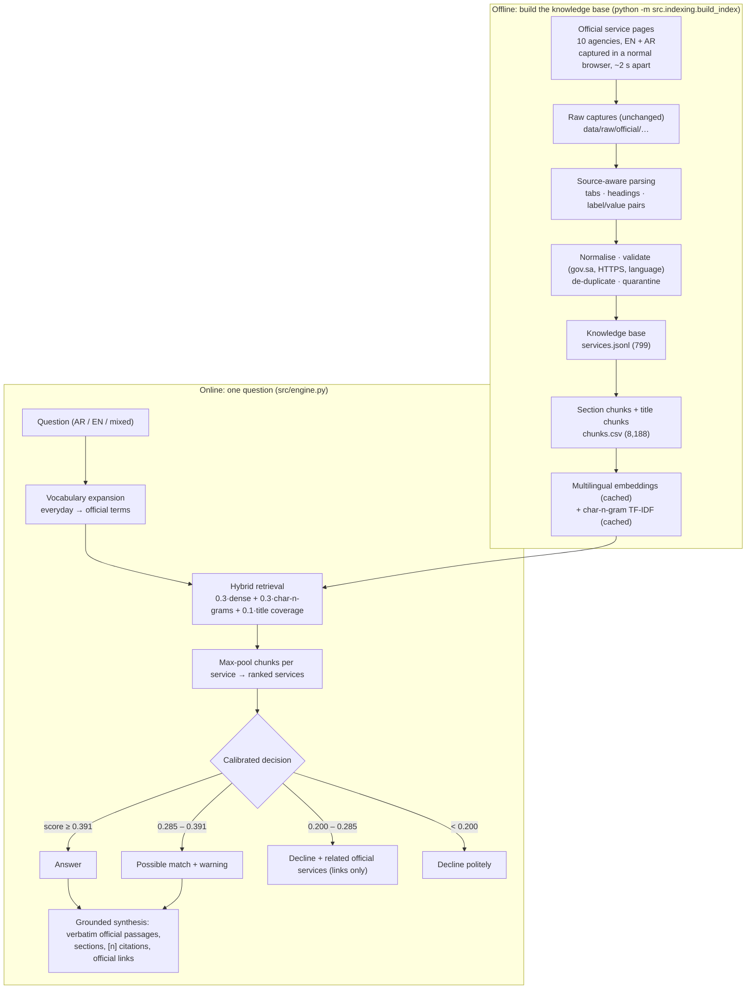

# Dalil AI · دليل

**A bilingual (Arabic–English) retrieval-grounded assistant for official Saudi public-service information.**

Ask a natural question in Arabic or English (*"How can I reserve a trade name?"*, «كيف أعادل شهادتي؟»). Dalil finds the matching official service pages across 10 government agencies, shows a structured answer built **only from verbatim official text** with numbered citations and links, and declines when its sources don't cover the question.

> **Disclaimer.** Dalil AI is an independent educational project and is **not affiliated with or endorsed by the Government of Saudi Arabia**. Always confirm details on the official page linked in each answer.
> **إخلاء مسؤولية:** «دليل» مشروع تعليمي مستقل، وليس تابعاً للحكومة السعودية أو معتمداً منها. يُرجى التحقق دائماً من الصفحة الرسمية المرفقة بكل إجابة.

---

## The problem

To find out how to do something (reserve a trade name, attest a document, get a building permit), a person has to know **which ministry** handles it, the **official service name**, and the **government wording** each site uses. Dalil's goal: **ask once, in your own words, instead of searching several government websites.**

## What Dalil is (and is not)

- **Is:** a *retrieval-grounded* assistant. It retrieves and organises official passages. Every fact on screen is a verbatim sentence or list item from a captured official page, with a citation `[n]`, the official URL and the capture date.
- **Is not:** a generative chatbot. No large language model writes the answers. This is deliberate: zero running cost, no API dependency, and nothing a model could make up (fees, documents, deadlines). Dalil adds only headings and one templated lead sentence ("The matching official service is …").
- **Does not** cover every Saudi government service (see *Coverage* and *Limitations*).

## Results (held-out test split, final corpus)

All numbers come from `python -m src.evaluation.evaluate_v2` (`data/evaluation/results_v2.json`). Settings and thresholds were chosen on the dev+val splits only.

| Metric (test: 120 answerable + 21 unanswerable questions) | V1 setting on the same corpus | **V2 (final)** |
|---|---|---|
| Top-1 retrieval (right service ranked first) | 70.0 % | **81.7 %** |
| Top-3 retrieval | 84.2 % | **93.3 %** |
| MRR | 0.780 | **0.884** |
| Answerable questions shown with the right service first | 60.8 % | **74.2 %** |
| False-refusal rate (answerable but declined) | 26.7 % | **17.5 %** |
| Confident answers that are correct | 100 % (1 confident answer only) | **91.9 %** (51.7 % of answerable are confident) |
| Unanswerable questions declined | 66.7 % | **61.9 %** |
| Unanswerable questions answered *confidently* | 0 % | **4.8 %** (1 of 21) |
| Answerable questions where the right service is shown (answer **or** "related official services" link) | — | **83.3 %** (100 of 120) |

By language (test, Top-1 / Top-3): **Arabic 86.8 % / 98.1 %** (n=53) · **English 79.4 % / 90.5 %** (n=63) · mixed Arabic/English 50 % / 75 % (n=4, too few to conclude).
Paraphrase robustness: in **85 %** of test families *every* phrasing finds the right service in the top 3 (V1 setting: 72 %).
Leakage checks: questions written *after* the vocabulary list was frozen reach Top-1 81.8 % (n=66), and switching query expansion off gives Top-1 79.2 %. The improvement is not coming from the vocabulary list.

**The trade-name question that V1 refused** ("How can I reserve a trade name?") now ranks Trade Name Reservation first and is shown as a *possible match* (score 0.382, confident threshold 0.391). "I want to book a business name" gets a confident answer.

**Speed** (2-core cloud CPU): cold start 4.7 s (was 8.7 s before caching the lexical index), full answer **92 ms median** (p95 0.4 s), repeated question 14 ms.

**Tests:** `python -m pytest` → **90 passed, 0 failed, 0 xfailed, 0 skipped**.

Historical V1 (73 Commerce services, 129-question benchmark): Top-1 69.6 %, Top-3 82.6 %, MRR 0.780, kept in `data/evaluation/v1_baseline/`. **Those are V1 numbers, not V2's.**

## Coverage

| Agency | Services indexed | Official Arabic text | Notes |
|---|---|---|---|
| Zakat, Tax and Customs Authority (ZATCA) | 161 | 161 | |
| Ministry of Municipalities and Housing (MoMAH) | 150 | 148 | 2 duplicates removed |
| Ministry of Justice (MoJ) | 148 | 148 | 3 duplicates removed |
| Ministry of Human Resources and Social Development (HRSD) | 125 | 125 | 1 service's pages returned 404 |
| Ministry of Commerce (MC) | 73 | 73 | 2 pages with only placeholders quarantined |
| Ministry of Education (MoE) | 49 | 47 | 1 Arabic page failed, 1 rejected by the language check |
| Ministry of Foreign Affairs (MOFA) | 42 | 42 | |
| Saudi Food and Drug Authority (SFDA) | 25 | 25 | 8 pages with no real content quarantined |
| Council of Health Insurance (CHI) | 15 | 0 | Arabic pages captured but not exported in this version |
| Ministry of Hajj and Umrah | 11 | 11 | |
| **Total** | **799** | **780** | 8,188 evidence chunks (4,126 EN / 4,062 AR) |

Captured 30 Sep – 1 Oct 2026. **Not covered** (blocked or unreachable, never bypassed): Ministry of Interior / Absher (passports inside the Kingdom, iqama, national ID, traffic), Ministry of Health, GOSI, Transport General Authority, my.gov.sa, MISA.

## How it works



In plain words: **question → add official synonyms → search every chunk of every service in two ways (meaning and spelling) → pick the best services → decide how sure we are → show only official text, with sources.**

Technical details:
- **Embeddings:** `sentence-transformers/paraphrase-multilingual-MiniLM-L12-v2` (384-d, Apache-2.0), L2-normalised, exact cosine search in NumPy. FAISS isn't needed at 8k vectors (it also failed to install on Windows in V1).
- **Lexical:** TF-IDF over character 3–5-grams with Arabic orthographic normalisation; robust to Arabic prefixes and suffixes and to misspellings.
- **Title coverage:** the share of a service title's words present in the query. It ranks down sibling services whose titles add words the user didn't say ("Extension of…").
- **Query expansion:** a small, general bilingual vocabulary (`src/retrieval/lexicon.py`, e.g. "business name" → "trade name", «أطلع» → «إصدار»). It contains no question-to-answer mappings and is applied to the lexical signals only.
- **BM25** was implemented and evaluated, but the dev+val selection gave it weight 0, so it is not used in the final configuration.
- **Related official services:** when Dalil declines but the question is still about public services (score ≥ 0.200, set just above the highest *out-of-domain* dev+val score), it lists up to 3 closest official services as **links only**, never their fees or steps as the answer. Test: 17 of 21 declined answerable questions got related links, 11 of them including the right service; 2 out-of-domain test questions also got links.
- **Decision:** two thresholds fitted on dev+val: decline below the one that keeps ≥80 % of unanswerable questions declined, and answer confidently above the one where ≥90 % of confident answers are correct.
- **Synthesis:** up to three close services. Sections (direct answer, what you need, documents, steps, fees & processing, who it is for, important notes, sources) appear only if the source states them. Question intent (fees / time / documents / steps) puts the relevant section first. Conflicting fees across agencies are flagged, and if official text exists only in the other language, a note says so (no machine translation).

## Run it

Requires Python 3.11+ (tested on 3.11 Linux; V1 ran on 3.13 Windows).

```bash
# 1) environment
python -m venv .venv
.venv\Scripts\activate            # Windows   |   source .venv/bin/activate  (macOS/Linux)
pip install -r requirements-dev.txt   # runtime deps + pytest

# 2) run the app (uses the prebuilt knowledge base and index in data/processed/)
streamlit run app.py

# 3) ask from the command line
python -m src.engine "How can I reserve a trade name?"
python -m src.engine "كيف أعادل شهادتي الجامعية؟"

# 4) tests
python -m pytest
```

The first run downloads the embedding model (~470 MB) from Hugging Face and caches it.

**Rebuild everything from raw captures** (only needed if the raw files are present; see *Data* below):

```bash
python -m src.indexing.build_index            # parse → validate → knowledge base → chunks → embeddings (incremental)
python data/evaluation/make_benchmark_v2.py   # regenerate benchmark_v2.csv
python -m src.evaluation.evaluate_v2          # grid search on dev, select on dev+val, report on test
```

## Data and provenance

```
data/
  raw/official/mc/                 Ministry of Commerce capture (V1)
  raw/official/v2/                 dalil_v2_<agency>.json captures (+ _arfix supplements)   ← not in git
  raw/seed/                        the 18 hand-written V0 records (quarantined, kept for history)
  processed/services.jsonl         the verified knowledge base (one record per service)
  processed/chunks.csv             section-level evidence chunks
  processed/embeddings.npy         cached embeddings (fingerprinted)
  processed/quarantine.jsonl       everything excluded, with the reason
  processed/build_report.json      per-agency page statistics and field coverage
  evaluation/                      benchmarks, results, per-question results, V1 baseline
```

Each record keeps: agency, official EN/AR URLs, capture time, a SHA-256 of each captured page, verification status, and which supplement file (if any) supplied a page. Missing fields stay empty and are never filled in.

**Raw captures are not committed to git.** Redistribution rights for verbatim government page HTML are unclear, and the files total about 200 MB. `scripts/browser_capture_v2.js` and `docs/data_provenance.md` explain how they were collected and how to re-collect them. See *Before publishing* for the processed data.

## Project layout

```
app.py                     Streamlit app (Ask · Explore · Knowledge base · Evaluation · About)
src/engine.py              single entry point: question → search → decision → answer (app, tests, CLI)
src/ingestion/             loaders, generic bilingual service-page parser, normalisation, validation, pipeline
src/indexing/              chunking, incremental embedding build
src/retrieval/             embedder, char-n-gram TF-IDF, BM25, lexicon, hybrid retriever
src/answering/             synthesizer (V2), composer (V1, kept for the baseline)
src/evaluation/            V1 evaluation, V2 evaluation (grid, thresholds, leakage checks, latency)
scripts/                   browser capture scripts (MC, generic V2)
tests/                     90 tests (parsers, regressions, Arabic, retrieval, grounding, integration)
docs/                      development log, methodology, architecture, provenance, report material
```

## Responsible AI

- **Grounding:** a test asserts that every point shown occurs verbatim in the cited record.
- **Calibrated uncertainty:** answer / possible match / decline, with thresholds fitted on held-out data and the trade-offs reported (including the 4.8 % of unanswerable questions answered confidently).
- **No bypassing** of anti-bot protection, logins or rate limits. Sites that blocked access are listed as coverage gaps.
- **No machine translation** presented as official text. A language check rejects an "Arabic" page that isn't Arabic.
- **Honest scope:** coverage numbers are computed from the knowledge base and shown in the app, and the disclaimer appears on every page.

## Limitations

- 799 services from 10 agencies, **not all Saudi government services**. Interior/Absher, Health and GOSI are missing.
- **Everyday Interior/Absher topics are missing** (iqama renewal, traffic/parking fines, passports inside the Kingdom, national ID): my.gov.sa blocks the browser with Cloudflare, absher.sa does not resolve and moi.gov.sa errors from the capture connection, and MOH runs a bot check. They were not bypassed. Such questions get lookalike "possible matches" or related links (e.g. iqama → MOFA Passport Renewal), which is the clearest current weakness.
- Questions about *nearby* services that aren't indexed often get a "possible match" from a lookalike service; only 62 % of unanswerable test questions are fully declined.
- Sibling services are the main error (e.g. "register my company for VAT" → "VAT Registration Verification").
- Arabic verb/noun forms («أستعلم» vs «الاستعلام») can cause false refusals. Colloquial phrasing scores lower than formal (Top-1 75 % vs 87 %).
- The benchmark was written by the author with AI assistance. Independent native-speaker questions would make it stronger. The unanswerable test set is small (21).
- Official pages change; answers show their capture date and the data must be re-captured periodically.
- CHI services are English-only in this version.

## HTTP API (for a web/mobile frontend)

`python -m uvicorn api.main:app --port 8000`, then open `/docs`. `POST /ask` returns a structured, cited answer with `response_type` = `answer` | `possible_match` | `related_services` | `unsupported`. `GET /services`, `/services/{id}`, `/agencies`, `/info`, `/stats` and `/health` are also available. By default the API runs the **V3 lite runtime** (no PyTorch, ~0.3 GB RAM, free-tier hosting; `DALIL_RUNTIME=full` serves the V2 transformer engine). Supports stateless follow-ups via `context_service_id`. See `docs/API.md`, `docs/V3_LITE.md` (V2 vs V3 evaluation) and `docs/DEPLOYMENT.md` (Render Free: `render.yaml`, `requirements-prod.txt`).

## Deployment

Localhost now. Deployment-ready for **Streamlit Community Cloud** (free): no secrets, relative paths only, CPU-only PyTorch, prebuilt index committed. See `docs/DEPLOYMENT.md`.

**Before publishing the repository publicly**, decide on the processed data (it contains verbatim official text). See `docs/DEPLOYMENT.md` → *Data licence decision*.

## Documentation

`PROJECT_REPORT.md` (final report) · `LEARNING_GUIDE.md` (concepts + interview Q&A) · `docs/DEVELOPMENT_LOG.md` · `docs/methodology.md` · `docs/architecture.md` · `docs/data_provenance.md` · `docs/MANUAL_ACCEPTANCE_TESTS.md` · `docs/DEPLOYMENT.md` · `docs/CV_BULLETS.md` · `docs/PORTFOLIO.md`

## Screenshots

`assets/screenshots/`: `ask_en.png` (trade-name answer), `ask_ar.png` (Arabic, RTL), `ask_related.png` (no exact answer → related services), `ask_refusal.png`, `ask_mobile_ar.png`, `explore.png`, `knowledge-base.png`, `evaluation.png`, `about.png`.
