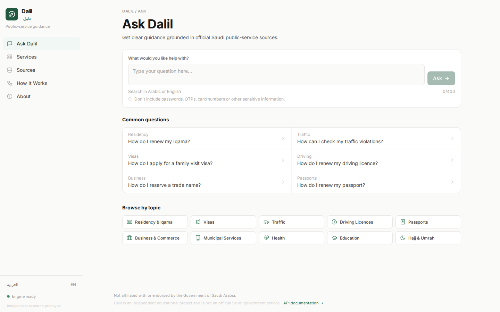
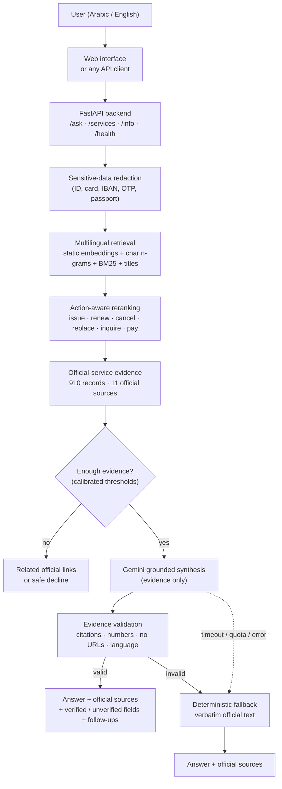
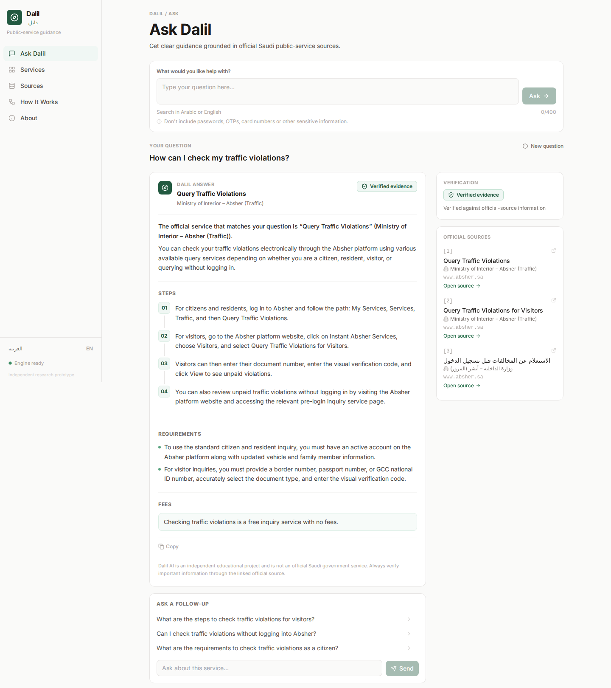
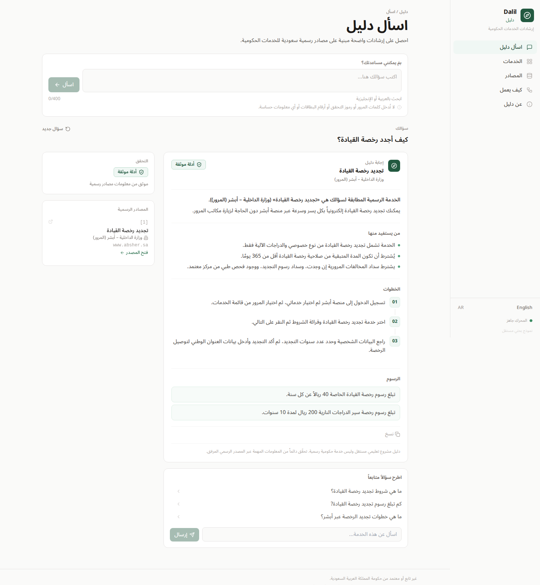
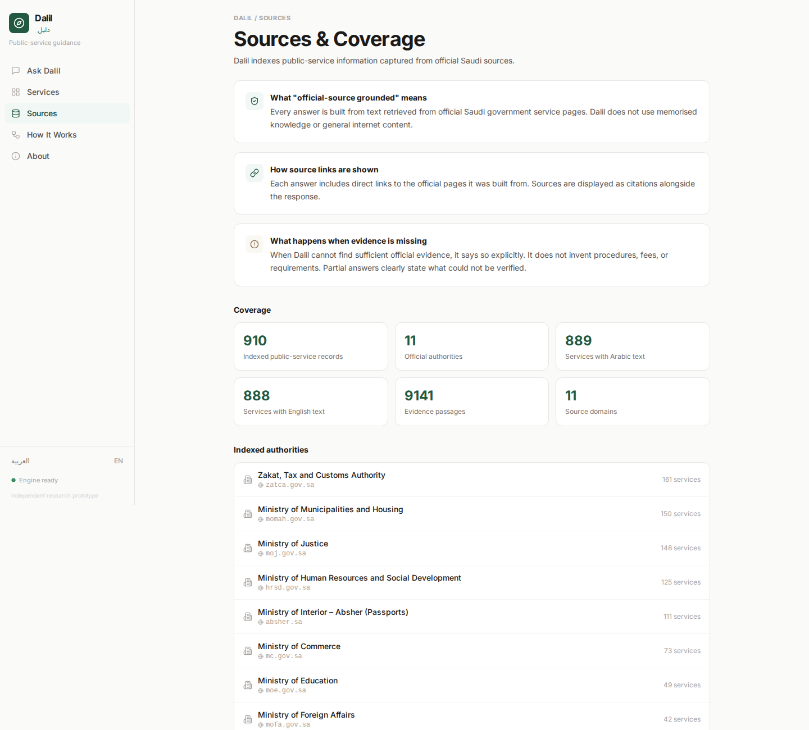
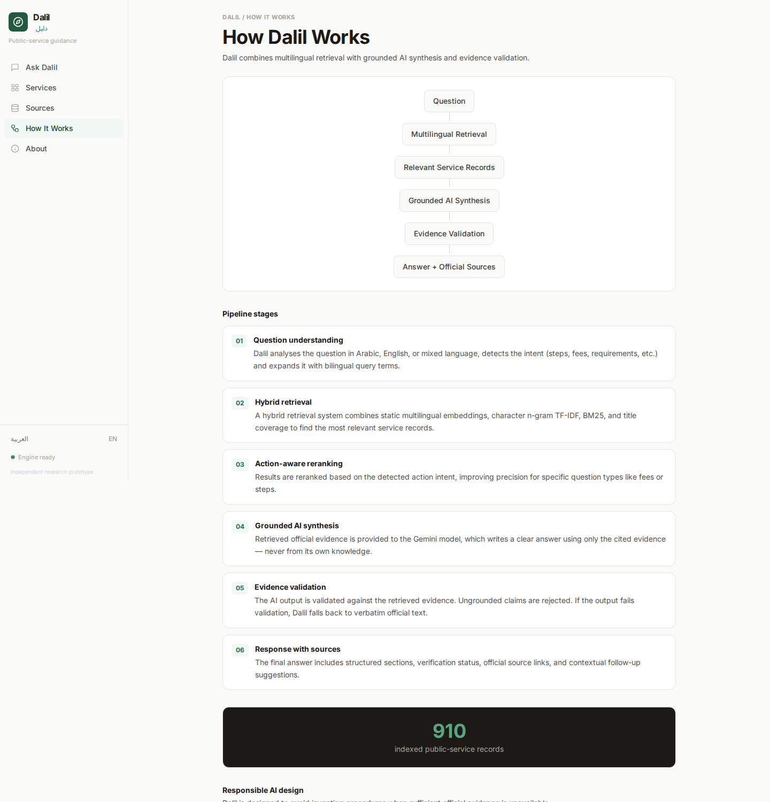
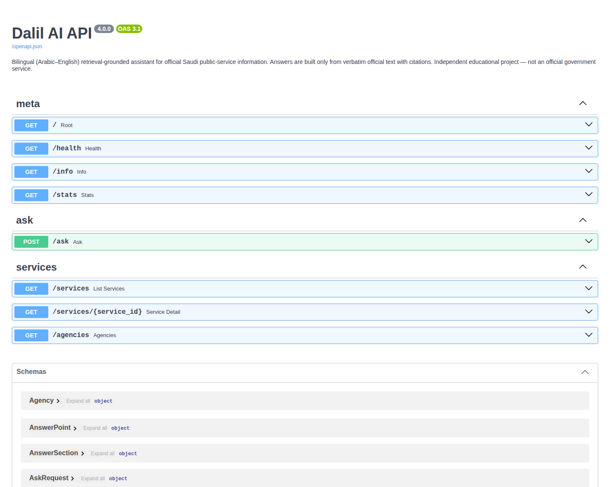

# Dalil AI · دليل
### Bilingual Grounded AI for Saudi Public-Service Information

**A deployed Arabic–English AI system that retrieves verified public-service evidence, generates grounded explanations, validates every response against that evidence and links users back to the official source.**


| | |
|---|---|
| **Live web app** | **[dalil-ai-production-tqj1.bolt.host](https://dalil-ai-production-tqj1.bolt.host/#/)** |
| **Live API** | [emanmusheer2008.pythonanywhere.com](https://emanmusheer2008.pythonanywhere.com) |
| **Interactive API docs** | [emanmusheer2008.pythonanywhere.com/docs](https://emanmusheer2008.pythonanywhere.com/docs) |
| **Source code** | [github.com/emanmusheer2008-glitch/dalil-ai](https://github.com/emanmusheer2008-glitch/dalil-ai) |
| **Author** | Eman Musheer |

> **Disclaimer.** Dalil AI is an independent educational project. It is **not affiliated with or endorsed by the Government of Saudi Arabia**, and it is not an official government service. Always confirm details on the official page linked in each answer.
> **إخلاء مسؤولية:** «دليل» مشروع تعليمي مستقل، وليس تابعاً للحكومة السعودية أو معتمداً منها، وليس خدمة حكومية رسمية.



---

## Contents
[Overview](#overview) · [Live demo](#live-demo) · [The problem](#the-problem) · [Solution](#solution) · [Key features](#key-features) · [Architecture](#system-architecture) · [How Dalil works](#how-dalil-works) · [Knowledge base](#dataset--knowledge-base) · [Retrieval](#retrieval-architecture) · [Grounded AI](#grounded-ai) · [Evidence validation](#evidence-validation) · [Evaluation](#evaluation) · [Evolution](#evolution-v1--v41) · [API](#api) · [Deployment](#deployment) · [Screenshots](#screenshots) · [Project structure](#project-structure) · [Testing](#testing) · [Responsible AI](#responsible-ai) · [Limitations](#limitations) · [Local setup](#local-setup) · [Tech stack](#technology-stack) · [Author](#author)

---

## Overview
Dalil (Arabic for *guide*) answers questions about Saudi public services, such as renewing an iqama, checking traffic violations, renewing a driving licence or reserving a trade name, in **Arabic or English**. Every answer is built from **910 official service records** captured from 11 Saudi government sources, and every answer cites the official page it came from.

The project was built end to end: data collection with provenance, a bilingual knowledge base, multilingual retrieval, a held-out evaluation benchmark, a calibrated answer policy, grounded generation with Google Gemini, automatic evidence validation, a FastAPI backend, a lightweight production runtime, a public deployment and a web interface.

## Live demo
- **Web app:** <https://dalil-ai-production-tqj1.bolt.host/#/>. Try the common questions, switch to العربية, or browse the 910 indexed services.
- **API:** `POST https://emanmusheer2008.pythonanywhere.com/ask`

```bash
curl -X POST https://emanmusheer2008.pythonanywhere.com/ask \
     -H "Content-Type: application/json" \
     -d '{"question": "How can I check my traffic violations?"}'
```
```bash
curl -X POST https://emanmusheer2008.pythonanywhere.com/ask \
     -H "Content-Type: application/json" \
     -d '{"question": "كيف أجدد رخصة القيادة؟"}'
```
Right after a server restart the first request can take a few seconds while the index loads; AI-generated answers take about 8–12 seconds.

## The problem
Saudi public-service information is spread across many agency portals, written in official administrative language and published in two languages. People search in everyday words ("I lost my passport", «ابي احجز اسم تجاري») and often cannot tell which agency or service applies. General-purpose chatbots answer confidently but can invent fees, documents and procedures, which is dangerous for government processes.

## Solution
Dalil keeps the **official evidence as the source of authority** and uses AI only for language:
1. Retrieve the matching official service records with a multilingual, action-aware retriever.
2. Let Gemini explain *only* that evidence in the user's language.
3. Validate the explanation automatically: every point must cite the evidence, every number must appear in the official text, and no generated links are allowed.
4. Return the answer with official source links, or say clearly what could not be verified.

## Key features
- **Bilingual:** Arabic and English questions and answers, including informal Gulf Arabic («وش المطلوب؟», «ابي احجز»).
- **910 official records** from 11 sources (Ministry of Interior/Absher, ZATCA, Ministry of Commerce, Justice, Municipalities and Housing, HRSD, Education, Foreign Affairs, Hajj and Umrah, SFDA, Council of Health Insurance), with capture date and SHA-256 provenance.
- **Multilingual hybrid retrieval:** static multilingual embeddings, character n-gram TF-IDF, BM25, title coverage and bilingual query expansion.
- **Action-aware reranking** distinguishes *issue / renew / cancel / replace / inquire / pay / dispute*, so "get a commercial registration" does not land on the *deletion* service.
- **Grounded Gemini synthesis** (`gemini-3.5-flash-lite`) writes structured sections: overview, eligibility, requirements, documents, steps, fees, processing time and where to apply.
- **Evidence validation:** uncited points, invented numbers and generated URLs are removed automatically.
- **Partial answers:** Dalil answers what the evidence supports and lists what it could not verify ("Dalil could not verify the current fee…").
- **Conversational follow-ups:** «كم الرسوم؟» stays on the previous service; a new topic is not forced onto it.
- **Safe refusal:** off-topic and uncovered questions get related official links or a clear decline, never an invented procedure.
- **Deterministic fallback:** if Gemini is unavailable, slow or produces ungrounded output, Dalil returns the verbatim official answer.
- **Privacy:** ID/iqama numbers, card numbers, IBANs, OTPs and passport numbers are redacted before any AI call.
- **Lightweight production runtime:** no PyTorch at run time; about 0.3 GB of RAM on a free hosting tier.

## System architecture


## How Dalil works
1. **Normalise and redact.** Arabic orthography is normalised (hamza forms, ة/ه, ى/ي) and personal identifiers are removed.
2. **Understand** (Gemini, only when needed). For weak matches and follow-ups, Gemini returns the intent, whether the question continues the previous service, and 3–5 search variants in official Arabic and English terminology. It never returns facts.
3. **Retrieve and rerank.** The original question and its variants are searched; results are merged and reranked by the requested action.
4. **Decide** with thresholds calibrated on a development split: *answer*, *possible match*, *related services* or *decline*. The AI can make this decision more cautious but never less.
5. **Synthesise.** Gemini receives the question and a compact evidence package (1–3 services, with evidence IDs such as `S1.fees`) and returns structured JSON.
6. **Validate and respond.** Invalid points are dropped; missing fields are listed as unverified; source links come from the records, never from the model.

## Dataset / knowledge base
| | |
|---|---|
| Records | **910** official service records (889 with Arabic text, 888 with English text) |
| Sources | 11 official Saudi sources: zatca.gov.sa, momah.gov.sa, moj.gov.sa, hrsd.gov.sa, absher.sa, mc.gov.sa, moe.gov.sa, mofa.gov.sa, haj.gov.sa, sfda.gov.sa, chi.gov.sa |
| Evidence passages | 9,141 bilingual chunks (description, eligibility, requirements, documents, steps, fees, processing time, audience) |
| Provenance | per record: official URL (EN/AR), capture timestamp, SHA-256 of the captured page, source domain, verification status |
| Validation | official-domain allowlist, required content, URL checks, language sanity checks, de-duplication; 33 records quarantined with reasons |

Text is stored **verbatim**. Fields a page does not state stay empty, and nothing is machine-translated into the official fields. When an official site blocked automated access, it was **not bypassed**; the same service was taken from another official source where possible. See [`docs/data_provenance.md`](docs/data_provenance.md).

## Retrieval architecture
- **Dense signal:** static word vectors distilled offline from the multilingual `paraphrase-multilingual-MiniLM-L12-v2` model for queries, matched against that model's precomputed chunk embeddings. The production server runs on NumPy only.
- **Lexical signals:** character n-gram TF-IDF (robust to Arabic morphology and spelling), BM25 and title coverage.
- **Bilingual lexicon:** general public-service vocabulary (e.g. *iqama → resident identity*, «ليسن» → «رخصة القيادة», *CR → commercial registration*). It contains no question-specific answers.
- **Action-aware reranking:** detects the action in the question and in each service title, in English and Arabic. Weights were selected on development data only. A "lost X" question matched to an "issue X" service is never answered confidently.
- **Follow-up context:** stateless, using `context_service_id` and `conversation_context`; no session storage.

## Grounded AI
Gemini is a **language tool, not a source of facts**. It may understand questions, rewrite queries, organise and translate evidence, and write clear explanations. It may **not** introduce fees, requirements, documents, deadlines, eligibility rules, contacts or URLs that are not in the cited evidence. Retrieved text and user questions are treated as data, so prompt-injection attempts ("ignore your evidence…") cannot unlock general knowledge. The API key is server-side only.

## Evidence validation
Every AI answer passes automatic checks before it is returned:

| Check | Rule |
|---|---|
| Citation | every point must cite valid evidence IDs from the package (`S1.steps`, …) |
| Numbers | every number in a point must appear in the cited official text |
| Links | any URL in generated text is rejected; sources come from the records |
| Language | the answer must be in the user's language |
| Downgrade only | the model can say "evidence doesn't answer this" (→ related links) but cannot upgrade weak retrieval |
| Fallback | if nothing valid remains, the verbatim official answer is returned |

Real-API checks: in a 10-question sample, 2 of 73 proposed points were rejected, all URLs came from records, the language was correct 10/10, and no unsupported or coverage-gap question was answered. In the V4.1 smoke test, 5 of 5 answers were grounded with 0 rejected points.

## Evaluation
All retrieval numbers come from the same **held-out benchmark** (250 realistic Arabic/English questions, split into dev / val / test). Configurations and thresholds were chosen on dev + val only and scored once on test (120 answerable + 21 unanswerable questions). Unanswerable questions measure safety.

**Final system (V4.1, 910 records, held-out test):**

| Top-1 | Top-3 | MRR | Confident-answer precision | Unsupported answered confidently |
|---:|---:|---:|---:|---:|
| **76.7%** | **86.7%** | **0.829** | **93.0%** | **1 / 21** |

**High-demand coverage check** (17 targeted questions on iqama, traffic violations, driving licences, passports and exit/re-entry, 13 of them with official evidence):

| | Before (799 records) | After (910 records) |
|---|---:|---:|
| Correct Top-1 | 0 / 13 | **11 / 13** |
| Correct in Top-3 | 0 / 13 | **13 / 13** |
| Coverage-gap questions answered confidently | 0 / 4 | **0 / 4** |

Each evaluation is reproducible: `src/evaluation/evaluate_v2.py`, `evaluate_v3.py`, `evaluate_v4.py`, `evaluate_v4_ai.py`, with results in [`data/evaluation/`](data/evaluation/).

## Evolution V1 → V4.1
| Version | What changed | Held-out result |
|---|---|---|
| **V1** | 73 Ministry of Commerce services; hybrid MiniLM + character n-gram TF-IDF; calibrated refusal | Top-1 69.6% · Top-3 82.6% · MRR 0.780 · unsupported declined 100% |
| **V2** | 799 records from 10 agencies; source-specific parsers; title coverage; bilingual lexicon; answer / possible-match / related / decline policy; new 250-question benchmark | Top-1 **81.7%** · Top-3 **93.3%** · MRR 0.884 · answerable refused 17.5% |
| **V3** | Lightweight production runtime: no PyTorch / transformers at run time (~0.3 GB RAM), stateless follow-ups | Top-1 77.5% · Top-3 89.2% · MRR 0.839 · confident precision **97.7%** · unsupported refused 81.0% |
| **V4** | Grounded Gemini synthesis, action-aware reranking, evidence validation, PII redaction, deterministic fallback, conversation context | retrieval as V3 · confident precision 95.5% · 171 tests |
| **V4.1** | +111 official Absher (Ministry of Interior) services: iqama, traffic, driving licences, passports, exit/re-entry, Istimara | Top-1 76.7% · Top-3 86.7% · MRR 0.829 · high-demand Top-1 0 → 11/13 · 174 tests |

V2 is preserved as the full research baseline (`DALIL_RUNTIME=full`); V3 is the lightweight runtime that V4 builds on.

## API
FastAPI, OpenAPI docs at [`/docs`](https://emanmusheer2008.pythonanywhere.com/docs). Full contract: [`docs/API.md`](docs/API.md).

| Method | Path | Purpose |
|---|---|---|
| GET | `/health` | readiness, runtime, service count |
| GET | `/info` | corpus, retrieval configuration, thresholds, AI status (never the key) |
| GET | `/stats` | evaluation results served from the evaluation files |
| POST | `/ask` | question → `response_mode`, answer, sections, official sources, evidence, verified / unverified fields, follow-ups |
| GET | `/services`, `/services/{id}` | browse and search the 910 records |
| GET | `/agencies` | agencies and their record counts |

`POST /ask` optional fields: `language` (`auto`/`en`/`ar`), `context_service_id`, `conversation_context`, `use_ai`.

## Deployment
- **Backend:** PythonAnywhere (free tier), FastAPI served by Uvicorn (ASGI), V4 runtime with about 0.3 GB of RAM, no PyTorch. `GEMINI_API_KEY` is loaded from a private server-side file. `DALIL_AI=off` switches to the deterministic answer without a code change.
- **Frontend:** React web interface built and hosted with Bolt. It calls the public API; its source is hosted on Bolt, separate from this repository.
- Dependencies for production: [`requirements-prod.txt`](requirements-prod.txt) (FastAPI, Uvicorn, NumPy, pandas, scikit-learn, BeautifulSoup). See [`docs/DEPLOYMENT.md`](docs/DEPLOYMENT.md).

## Screenshots
| | |
|---|---|
|  |  |
| **Grounded English answer.** Steps, requirements and fees with the verification badge and numbered official Absher sources. | **Arabic answer (RTL).** Driving-licence renewal with eligibility, requirements, steps, fees and suggested follow-ups. |
|  |  |
| **Explore services.** All 910 indexed records, searchable and filterable by agency, with AR/EN availability. | **Sources and coverage.** The grounding policy and coverage by official authority. |
|  |  |
| **How Dalil works.** Pipeline stages from question to cited answer. | **Interactive API documentation** (FastAPI / OpenAPI). |

All screenshots are from the live public web app and API. Earlier screenshots of the Streamlit research interface are in [`assets/screenshots/`](assets/screenshots/).

## Project structure
```
dalil-ai/
├── api/                    # FastAPI app (main.py) and request/response schemas
├── src/
│   ├── ingestion/          # official-source loaders, parsers, validation, provenance (incl. Absher guide)
│   ├── indexing/           # chunking and embedding index build
│   ├── retrieval/          # hybrid retriever, BM25, TF-IDF, bilingual lexicon
│   ├── lite/               # V3 lightweight runtime (static embeddings, no PyTorch)
│   ├── v4/                 # grounded AI layer: engine, Gemini client, action reranking, redaction
│   ├── answering/          # structured answer synthesis from verbatim official text
│   └── evaluation/         # benchmark evaluation V2 / V3 / V4, real-API checks
├── data/
│   ├── processed/          # knowledge base (services.jsonl), chunks, embeddings, configs
│   └── evaluation/         # benchmark questions and all evaluation results
├── tests/                  # 174 automated tests
├── docs/                   # architecture, methodology, provenance, API, deployment, V3/V4 notes, screenshots
├── app.py                  # Streamlit research interface (V2)
└── requirements*.txt       # full research / production / development dependencies
```

## Testing
```bash
pip install -r requirements-dev.txt
python -m pytest -q          # 174 passed
```
The suite covers ingestion and parsers, Arabic normalisation, chunking and index integrity, retrieval and answer policy, the V2 / V3 / V4 APIs, the lite runtime without PyTorch, follow-up context, action distinction, PII redaction, prompt injection, Gemini failure modes (missing key, timeout, quota, rate limit, malformed JSON, ungrounded output), citation and URL integrity, and partial answers. Gemini is mocked in tests; real-API checks are separate scripts.

## Responsible AI
- **Evidence over generation:** official records are the authority; the model explains them and cannot add facts.
- **Honest uncertainty:** partial answers state what is unverified; uncovered questions get links or a decline.
- **Privacy by design:** identifiers are redacted before any AI call; Dalil does not store questions or answers.
- **Transparency:** every answer shows its official sources, verification status and whether the text is verbatim or AI-written from cited evidence.
- **Clear status:** independent educational project, not an official government service.
- **No bypassing:** sites that blocked automated collection were not circumvented.

## Limitations
- **Coverage is not exhaustive.** 910 services cover high-demand areas but not every Saudi public service. For example, replacing a lost iqama or a lost driving licence had no accessible official page; Dalil shows related links instead of answering.
- **Some official pages were inaccessible to automated collection** (e.g. my.gov.sa and moi.gov.sa), so some services come from a single official source.
- **Some records exist in one language only** (22 Arabic-only, 2 English-only); Dalil explains them in the user's language while citing the original.
- **Retrieval ambiguities remain.** Questions like "renew my iqama" match both the employer service and the individual service; a few benchmark questions route to a related service.
- **Partial answers** occur when the official evidence lacks a requested field such as a fee.
- **Speed:** AI answers take about 8–12 seconds on the free tier; the deterministic answer takes about 0.1 s.
- **Web interface:** some arbitrary manually typed questions are not handled correctly by the current public web interface, even though the backend API answers them; the built-in common questions, topic browsing and follow-ups work.

## Local setup
```bash
git clone https://github.com/emanmusheer2008-glitch/dalil-ai.git
cd dalil-ai
python -m venv .venv
# Windows: .venv\Scripts\activate      macOS/Linux: source .venv/bin/activate
pip install -r requirements-prod.txt          # lightweight runtime (add requirements-dev.txt for tests)
python -m uvicorn api.main:app --port 8000    # http://127.0.0.1:8000/docs
```
Optional AI layer: set `GEMINI_API_KEY` (and optionally `GEMINI_MODEL`) in the server environment; without it, Dalil serves the deterministic, verbatim answers. The full research environment (`requirements.txt`, PyTorch) is needed only to rebuild embeddings or run `DALIL_RUNTIME=full`.

## Technology stack
| Layer | Tools |
|---|---|
| Language & data | Python 3.11, pandas, NumPy, BeautifulSoup |
| Retrieval | scikit-learn (TF-IDF), BM25, multilingual MiniLM embeddings (offline) → static vectors (runtime) |
| Generative AI | Google Gemini API (`gemini-3.5-flash-lite`), structured JSON output, evidence validation |
| Backend | FastAPI, Uvicorn, Pydantic |
| Deployment | PythonAnywhere (API), Bolt (web interface) |
| Research interface | Streamlit |
| Quality | pytest (174 tests), reproducible evaluation scripts |

## Author
**Eman Musheer** — aspiring AI Engineer and Data Science student.
GitHub: [@emanmusheer2008-glitch](https://github.com/emanmusheer2008-glitch)

More detail: [`PROJECT_REPORT.md`](PROJECT_REPORT.md) · [`docs/architecture.md`](docs/architecture.md) · [`docs/methodology.md`](docs/methodology.md) · [`docs/V3_LITE.md`](docs/V3_LITE.md) · [`docs/V4.md`](docs/V4.md) · [`docs/DEVELOPMENT_LOG.md`](docs/DEVELOPMENT_LOG.md) · [`LEARNING_GUIDE.md`](LEARNING_GUIDE.md)
