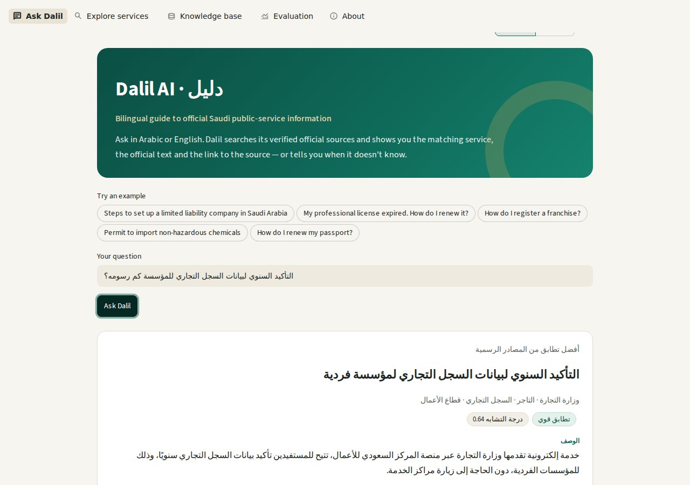
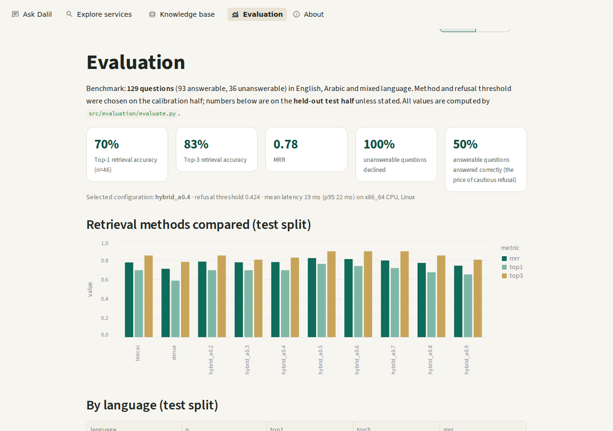
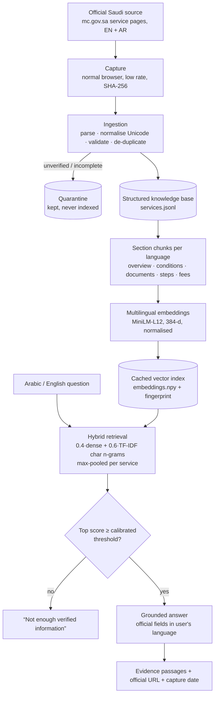

# Dalil AI · دليل

**A bilingual (Arabic–English) retrieval-grounded assistant for official Saudi public-service information.**

Ask *"How do I convert my sole proprietorship into a company?"* or *"كم رسوم التأكيد السنوي للسجل التجاري؟"* — Dalil finds the matching official service, shows its **official text** (conditions, documents, steps, fees, duration) in your language, highlights the passages that matched, and links to the source page. If it has no verified information, it says so instead of guessing.

> **Live demo:** _link to be added after deployment (see [Deployment](#deployment))_
>
> Dalil AI is an independent educational project and is **not** an official Saudi government service. Always verify important information through the linked official source.

| Arabic question → official Arabic answer | Evaluation dashboard |
|---|---|
|  |  |

---

## Why

Saudi public-service information is spread across many official websites, in two languages and in administrative wording. People rarely know a service's official name ("I want to reserve a name for my shop" → *Trade Name Reservation*). General chatbots answer fluently but can invent fees or documents — unacceptable for government procedures. Dalil explores a narrower, safer idea:

> **Research question (independent engineering experiment):** *How effectively can multilingual semantic retrieval provide grounded Arabic–English access to Saudi public-service information?*

## What it does — and doesn't

- ✅ Answers questions over the **currently indexed official corpus**: **73 Ministry of Commerce e-services**, each with official **English and Arabic** text (captured 30 Sep 2026).
- ✅ Shows only fields the official page states; never fills gaps.
- ✅ Cites every answer (official URL in both languages, capture date, page's last-modified date).
- ✅ Declines unsupported questions using a threshold **calibrated on data**.
- ❌ Does **not** cover all Saudi government services.
- ❌ Does **not** generate text with a language model. It is a *retrieval-grounded* assistant, i.e. the retrieval half of RAG — not "generative RAG".
- ❌ No paid APIs, databases or hosting. Total cost: **$0**.

## Architecture



## Data & provenance

| | |
|---|---|
| Source | Ministry of Commerce e-services catalogue, `mc.gov.sa` (75 service-detail pages × English + Arabic = 150 pages, all HTTP 200) |
| Indexed | **73 services**, **730 chunks** (365 EN / 365 AR) |
| Quarantined | 2 MC pages with no description on the official page; 18 hand-written prototype seed records (not traceable to captured text) |
| Per record | official URLs (EN/AR), capture timestamp, SHA-256 of captured HTML, source "last modified" date, verification status |

**How the data was obtained.** `my.gov.sa` refuses automated requests (HTTP 403 / Cloudflare), so it was **not** used — Dalil never bypasses access controls. The Ministry of Commerce publishes the same kind of information openly; its public pages were captured from a normal browser session at roughly one request every few seconds with [`scripts/browser_capture_mc.js`](scripts/browser_capture_mc.js), storing the page HTML verbatim. Parsing happens in tested Python ([`src/ingestion/mc_catalog.py`](src/ingestion/mc_catalog.py)). Full details: [docs/data_provenance.md](docs/data_provenance.md).

**Adding more sources** needs no new code: save official pages from a browser into `data/raw/manual/` with a small `.meta.json` ([document_loader.py](src/ingestion/document_loader.py)), or drop an official open-data file plus a column mapping into `data/raw/open_data/` ([official_open_data.py](src/ingestion/official_open_data.py)).

## Retrieval method

1. **Chunking** — each service is split per language into overview / conditions / required documents / steps / fees & details. Each chunk keeps service id, title, agency, section, language and URL.
2. **Dense** — `sentence-transformers/paraphrase-multilingual-MiniLM-L12-v2` (free, CPU). Vectors are L2-normalised so cosine similarity is a dot product. **No FAISS**: exact NumPy search over 730 vectors is sub-millisecond.
3. **Lexical** — TF-IDF over character 3–5-grams after Arabic normalisation (alef/ya/taa-marbuta unification, diacritics removed), which copes with Arabic prefixes/suffixes.
4. **Hybrid** — `α·dense + (1−α)·lexical`; chunk scores max-pooled per service (also removes duplicates).
5. **Refusal** — answer only if the top score ≥ threshold.
6. **Answer composer** — official fields in the question's language (if that official version exists; otherwise the original is shown with a note — never a machine translation), matching passages, links.

## Evaluation

Benchmark: **129 questions** — 93 answerable (44 English, 44 Arabic, 5 mixed Arabic/English; paraphrased and "hard" low-keyword-overlap wording) and 36 unanswerable (12 out-of-domain, 24 *real government services that are not indexed*, e.g. passports, VAT, GOSI). It was written before running retrieval ([how](data/evaluation/make_benchmark.py)) and split by service into a **calibration** half (used to choose the method, α and threshold) and a **held-out test** half (used only for reporting). Everything below is produced by `python -m src.evaluation.evaluate` → [`data/evaluation/results.json`](data/evaluation/results.json).

**Method comparison (test half, 46 answerable questions)**

| Method | Top-1 | Top-3 | MRR |
|---|---|---|---|
| Lexical (TF-IDF char n-grams) | 69.6% | 84.8% | 0.776 |
| Dense (multilingual embeddings) | 58.7% | 78.3% | 0.710 |
| **Hybrid α=0.4 (selected on calibration)** | **69.6%** | **82.6%** | **0.780** |

Hybrid was clearly best on the calibration half (MRR 0.834 vs 0.725 lexical, 0.673 dense). On the test half it ties lexical on Top-1; α=0.5 would have scored higher on test (76.1% / 0.821) but was not chosen, because choosing by test results would inflate the numbers.

**By language (test, selected method):** Arabic Top-1 72.7% (n=22) · English Top-1 63.6%, Top-3 90.9% (n=22) · mixed 2/2.

**Cross-lingual experiment** (all 44 Arabic / 44 English answerable questions, searching only the *other* language's text):

| Setting | Lexical Top-1 | Dense Top-1 |
|---|---|---|
| Arabic question → English text only | 2.3% | **59.1%** |
| English question → Arabic text only | 4.5% | **29.5%** |

Keyword matching cannot cross languages; multilingual embeddings can — though far better Arabic→English than English→Arabic in this model. Having official text in *both* languages matters: Arabic→Arabic hybrid reaches 75.0% Top-1.

**Refusal (test half, threshold 0.424 chosen on calibration by balanced accuracy):** 16/16 unanswerable questions declined (100%, both out-of-domain and not-indexed), but only **50%** of answerable questions were answered with the correct service; the rest were mostly declined. Dalil is deliberately cautious — the dashboard's threshold curve shows the trade-off.

**Latency:** mean 19 ms, p95 22 ms per query (hybrid search incl. query embedding) on a 2-vCPU Linux cloud container.

## Run it

```bash
git clone <your-repo-url> dalil-ai && cd dalil-ai
python -m venv .venv
.venv\Scripts\activate            # Windows  (macOS/Linux: source .venv/bin/activate)
pip install -r requirements-dev.txt

streamlit run app.py              # uses the prebuilt index in data/processed/
```

The model (~470 MB) downloads from Hugging Face on first run and is cached. To use a local copy instead, set `DALIL_MODEL_PATH` to its folder.

Rebuild everything from the raw capture:

```bash
python -m src.indexing.build_index        # ingest → validate → chunk → embed (cached)
python -m src.evaluation.evaluate          # benchmark, calibration, results.json
python -m pytest                           # 53 tests (unit + integration with the real model)
```

## Tests

`pytest` covers schema validation, all loaders, missing values (never invented), duplicate detection, Arabic Unicode normalisation and UTF-8, chunk metadata/citation preservation, retrieval (dense/lexical/hybrid, language filtering, de-duplication), the answer composer (refusal, official-text-only fields, Arabic fallback note), metrics, index caching and stale-cache detection, plus end-to-end integration tests with the real model. Current status: **52 passed, 1 expected failure** (a documented Arabic ranking weakness, below).

## Project structure

```
app.py                      Streamlit app (Ask · Explore · Knowledge base · Evaluation · About)
src/
  config.py  schema.py  ui.py
  ingestion/   mc_catalog.py  document_loader.py  official_open_data.py  csv_loader.py
               json_loader.py  normalization.py  validation.py  pipeline.py
  indexing/    chunking.py  build_index.py
  retrieval/   embedder.py  lexical.py  retriever.py
  answering/   composer.py
  evaluation/  metrics.py  evaluate.py
  utils/       arabic.py
data/
  raw/official/mc/mc_services_capture.json   captured official pages (EN + AR)
  raw/seed/services_seed_v0.csv               original prototype seed (quarantined)
  processed/   services.jsonl/.csv  chunks.csv  embeddings.npy  index_meta.json
               build_report.json  quarantine.jsonl  retrieval_config.json
  evaluation/  make_benchmark.py  benchmark.csv  results.json  per_query_results.csv
scripts/browser_capture_mc.js                 reproducible capture script
docs/        methodology.md  data_provenance.md  architecture.md  DEVELOPMENT_LOG.md  CV_BULLETS.md  archive/
tests/       unit + integration tests
LEARNING_GUIDE.md
```

## Limitations

- **Coverage:** one ministry, 73 services. Questions about other agencies are declined, not answered.
- **Cautious refusal:** with a single similarity threshold, about half of answerable test questions are declined along with all unanswerable ones.
- **Near-duplicate services:** e.g. in Arabic, *reserve / extend / cancel a trade-name reservation* share the phrase «حجز اسم تجاري»; the base service can be outranked (recorded as an expected test failure).
- **Benchmark:** 129 questions written by the project author with AI assistance; not independent, and small (±7–10 percentage points of noise on the test half).
- **Freshness:** official pages change; answers show capture and last-modified dates, and data should be re-captured periodically.
- **Dialects:** tested with Modern Standard and some Saudi colloquial Arabic only.

## Responsible AI

Official text only (no generated facts, no machine translation labelled as official) · source link and dates on every answer · calibrated refusal · quarantine for unverifiable data · no bypassing of access controls · no user accounts, no query logging, Streamlit telemetry disabled · no secrets in the repository.

## Deployment

Free target: **Streamlit Community Cloud** (free for public and private GitHub repos; ~2.7 GB RAM, enough for the model). Steps:

1. Push this repository to GitHub (check [docs/data_provenance.md](docs/data_provenance.md) on redistribution first).
2. At share.streamlit.io → *Create app* → pick the repo, branch, `app.py`.
3. First boot downloads the model (a few minutes). The app sleeps after 12 h without traffic and wakes on the next visit.

No secrets or environment variables are required.

## Future work

Official open-data feeds of services · more agencies via saved official pages · independent native-speaker benchmark · a cross-encoder re-ranker for near-duplicate services · per-query-type thresholds · an optional generator constrained to quote retrieved chunks (true RAG).

## Author

Independent AI engineering project (2026) by a student preparing for AI Engineering / Data Science study. Built with AI coding assistance; every design decision, data source and metric is documented and reproducible. See [docs/DEVELOPMENT_LOG.md](docs/DEVELOPMENT_LOG.md) and [LEARNING_GUIDE.md](LEARNING_GUIDE.md).
