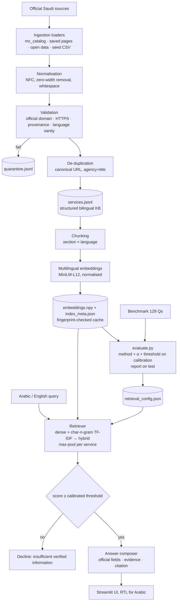

# Architecture

## Components

| Module | Responsibility |
|---|---|
| `src/schema.py` | Canonical `ServiceRecord`; `_en`/`_ar` official-text fields; provenance fields; controlled vocabularies |
| `src/ingestion/*` | One loader per source type; `pipeline.py` runs load → normalise → validate → de-duplicate → write + report |
| `src/indexing/chunking.py` | Section/language chunks with citation metadata; content fingerprint |
| `src/indexing/build_index.py` | Embeds chunks once, reuses cache if fingerprint + model unchanged |
| `src/retrieval/` | Lazy model loading, lexical index, `Retriever.search()` with three methods |
| `src/answering/composer.py` | Threshold decision; official-text-only answer; language selection; evidence |
| `src/evaluation/` | Metrics, method selection, threshold calibration, cross-lingual experiment, latency |
| `app.py`, `src/ui.py` | Streamlit pages, bilingual UI strings, escaped HTML cards |

## Key decisions

- **No FAISS** — exact NumPy search over 730 vectors is sub-millisecond; FAISS failed to install and adds nothing at this scale.
- **No generative model** — zero cost and no hallucinated facts; the composer shows official text.
- **Section-level chunks** — precise evidence and better matching of "fees"/"documents" questions.
- **Calibration/test split** — choices are made on one half, reported on the other.
- **Streamlit** — the app is Python end-to-end and deploys free; a React rewrite would add complexity without improving what is measured.
