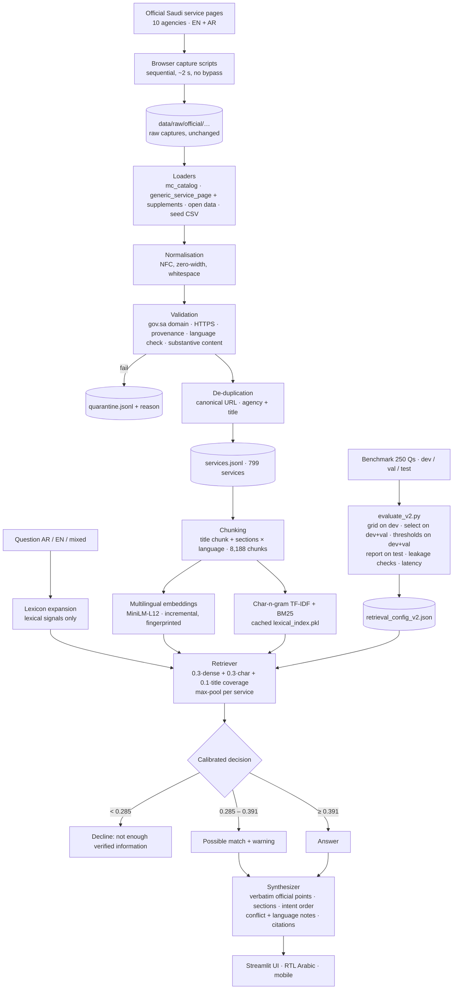

# Architecture (V2)

`src/engine.py` (`Dalil.ask`) is the single path from question to answer. The app, the integration tests, the latency measurement and the CLI all call it.

## Components

| Module | Responsibility |
|---|---|
| `src/schema.py` | Canonical `ServiceRecord`: `_en`/`_ar` official-text fields, provenance fields |
| `src/ingestion/generic_service_page.py` | One bilingual parser for the V2 sites (SharePoint, Drupal, custom): tabs (ARIA, Bootstrap, in-page anchors), headings, bold/field labels, label/value pairs; drops related-services cards, widgets, placeholders; loader with supplement merging and a language check |
| `src/ingestion/mc_catalog.py` | Ministry of Commerce parser (V1) |
| `src/ingestion/validation.py`, `pipeline.py` | Validation rules, de-duplication, quarantine, build report with per-agency page statistics |
| `src/indexing/` | Chunking with citation metadata; incremental embedding build |
| `src/retrieval/` | Lazy model, char-n-gram TF-IDF, BM25, bilingual lexicon, hybrid `Retriever` with title coverage and a cached lexical index |
| `src/answering/synthesizer.py` | Three-way decision; sectioned answer from verbatim official text; intent ordering; fee-conflict and language notes |
| `src/engine.py` | `Dalil` engine + CLI |
| `src/evaluation/evaluate_v2.py` | Grid search, selection, thresholds, decision metrics, per-language/style breakdowns, paraphrase robustness, leakage checks, latency |
| `app.py`, `src/ui.py` | Streamlit pages, bilingual strings, escaped HTML cards |

## Key decisions

- **No FAISS:** exact NumPy search over 8k vectors takes milliseconds; FAISS failed to install on Windows and adds nothing at this scale.
- **No generative model:** zero cost, no hallucinated facts, reproducible. The synthesizer only arranges official text.
- **Hybrid retrieval:** dense similarity bridges languages and paraphrases; character n-grams catch exact service names, Arabic morphology and misspellings. Each alone is worse on test (dense 71.7 %, char 68.3 % Top-1 vs 81.7 % hybrid).
- **A middle "possible match" state** instead of one cliff threshold. This was the root cause of the V1 trade-name refusal.
- **Calibrate on dev+val, report on test**, with leakage checks.
- **Caching** of the model, embeddings and lexical index: no per-query reloading or refitting.
- **Streamlit:** Python end to end, free hosting. A separate API/microservice layer would add moving parts without improving anything measured.
